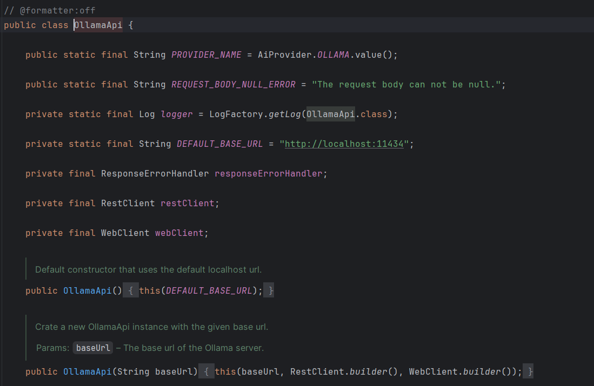

# ocr-with-ai

I am going to explore different ideas and ai concepts in this project, that are not directly related to
the main project, but are still interesting and useful.

## Model to use

- We are going to use Ollama, a tool that allows you to run large language models locally on your machine.

### Ollama

Ollama is a tool that allows you to run large language models locally on your machine.

````
C:\Users\MikeHenry>ollama serve
Error: listen tcp 127.0.0.1:11434: bind: Only one usage of each socket address (protocol/network address/port) is normally permitted.
````

This `127.0.0.1:11434` is already autoconfigured in the Ollama api class



